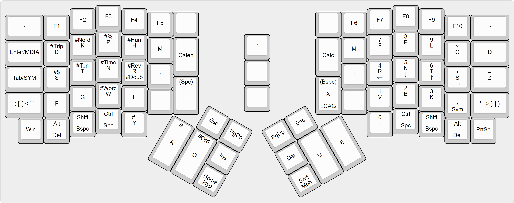

# Sparrowhawk

    

Sparrowhawk (stylized `sphk`) is a stenographic (chord-based) input system designed to improve the efficiency and ergonomics of keyboard usage in the 21st century and beyond.

In particular, `sphk` makes it possible to:

- Input natural language at speeds in excess of 200WPM (currently, English and Japanese supported)
- Navigate and edit text from the comfort of the home row
- Input symbols and Unicode characters semantically
- Input numbers on a chorded ten-key numpad
- Execute application-specific keyboard shortcuts and system-wide macros semantically

`sphk` has been in active development and full-time use since early 2017, and is now in the process of being documented and released for the world to see :) .

**Contents**

<!-- MarkdownTOC -->

- [Demos](#demos)
- [Keymap](#keymap)
- [Theory](#theory)
- [Acknowledgements](#acknowledgements)

<!-- /MarkdownTOC -->

## Demos
Stenoing song lyrics to demonstrate basic usage. `sphk` was initially implemented on the ErgoDox EZ but is now implemented on the purpose-built [aodox](https://github.com/jkcrw/aodox).

_More up-to-date demos and videos coming soon..._

## Keymap
_Main keymap image shown above woefully out-of-date but mostly correct. Will update soon..._

## Theory
_Documentation coming soon..._

## Acknowledgements
`sphk` would not be possible without and gives its deepest heartfelt thanks to:

- [Plover](https://github.com/openstenoproject/plover), the amazing open-source steno engine
- [Open Steno Project](http://www.openstenoproject.org), a community of open-source steno rockstars
